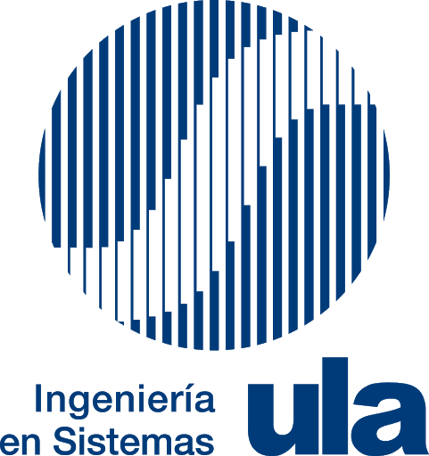

<p align="center">

</p>

___
[](https://www.gnu.org/licenses/gpl-3.0)
[](https://github.com/hassanalinali/Lesma/blob/master/LICENSE.md)
[](https://circleci.com/gh/hassanalinali/Lesma/tree/master)
[](https://www.codacy.com/app/hassanalinali/Lesma?utm_source=github.com&amp;utm_medium=referral&amp;utm_content=hassanalinali/Lesma&amp;utm_campaign=Badge_Grade)

El lenguaje de programación ULA (Universal LAnguague) es un lenguaje de programación cuya sintaxis está definida enteramente en español, de codificación flexible y orientado al desarrollo de las capacidades de programación en niños y jóvenes interesados en aprender sobre este arte. ULA está construido sobre **Lesma**, un lenguaje estáticamente tipado, imperativo y orientado a objetos desarrollado por el usuario [Hassan Alin Ali](https://github.com/hassanalinali). El lenguaje se encuentra desarrollado en Python usando LLVM como backend.

## Documentación

- [Documentación](https://juliolugo96.github.io/ula-lang/)
  

## Correr el lenguaje

Para correr el lenguaje ULA, debes tener instalado la versión de [Python 3.5](https://www.python.org/) o superior. Actualmente, el núcleo del lenguaje ha sido probado en Linux. Hace uso de Clang para compilar el archivo objeto resultante, por lo que vas a necesitar instalarlo; sin embargo, solo correr un archivo no requiere que lo tengas instalado.

Clona este repositorio:
```bash
git clone https://github.com/juliolugo96/ula-lang
```

Te recomiendo crear tu propio ambiente virtual con [virtualenv](https://rukbottoland.com/blog/tutorial-de-python-virtualenv/) antes de proseguir.

Instala los requerimientos
```bash
sudo apt install clang -y
pip install -r requirements.txt
```
Al tener esto realizado, puedes correr el compilador o el interprete, crea un archivo de prueba y comienza a desarrollar. Recuerda que hay muchos ejemplos en la documentación.

Para ejecutar ULA, debes primero ejecutar los siguientes comandos:

```bash
# Para dar permisos de Ejecución a ULA
chmod +x ula

# Para poder tener acceso al script desde la terminal
export PATH=$PATH:/ruta/de/este/repositorio
```

```bash
# Para compilar
ula tuarchivo.ula

# Para correr en modo interprete

ula tuarchivo.ula run

# Para ejecutar codigo objeto generado luego de la compilación
ula tuobjeto.output run
```